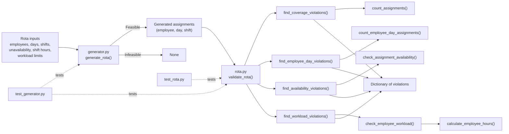

# Code map

## Main functions

| Function | Takes | Returns |
|---|---|---|
| `generate_rota()` | Employees, days, shifts, availability, staffing requirements, shift hours and workload limits | Assignment list, or `None` |
| `validate_rota()` | Assignment list and rota information | Dictionary containing each category of violation |
| `count_assignments()` | Assignments, one day and one shift | Number of assigned employees |
| `calculate_employee_hours()` | Assignments, one employee and shift durations | Total assigned hours |
| `check_employee_workload()` | Assignments and one employee's workload limits | Warning string, or `None` |